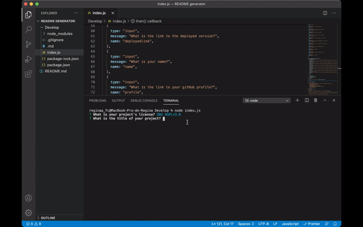

# Good README Generator

## License
 

Click here to see the full app video: <https://drive.google.com/file/d/1HCchIzx4jA54qsoagjjJ_WjqTsxYVgbL/view>

## Description 📝

This is an application created to make good README files fast an easy ;)

## Table of Contents 📋
Here's a table of contents to make it easier to find what what you are looking for.
- [Instructions](#instructions) 
- [Installation](#installation) 
- [Usage](#usage) 
- [Questions](#questions)
- [Credits](#credits)

## Instructions 
First you have to clone this repo and install the node modules and inquirer, then you have to run the index.js and answer the questions that will show in the terminal, once you have fully completed this steps you will be presented with a personalized readme file.

## Installation 
Once you are in my gitgub repository for this project, <https:readme >: 
 
1.- First you need to get the HTTPS or GitHub CLI from the green button in the top right corner that says "Code". 🟢
 
2.- Once you have copied the URL, open your terminal and cd to the place where you want to put the clone. 
 
3.- Then write the next code "git clone and the link you've copied ".
 
4._Once you have clone the repo make sure to have installed inquirer before running the index.js file

## Usage
Use this app to make read me files for your projects.

## Questions
If you have any question contact me to my email: francoc.regina@yahoo.com.mx

## Credits
Created with ♥️ by regina, <https://github.com/reginaafc>.
  
